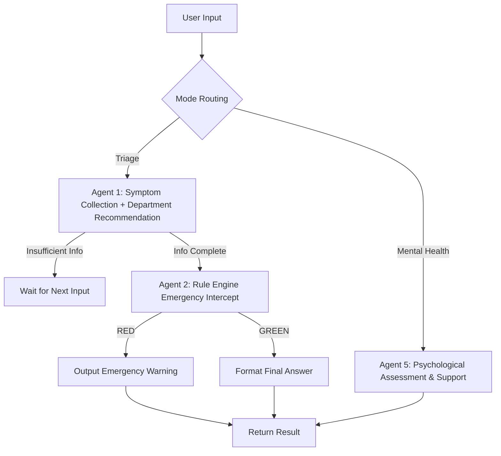

```markdown
# 🏥 AI Health Triage Assistant

> *An intelligent triage and psychological support system built with LangGraph and DeepSeek-V3 — reducing API calls to a single LLM invocation per consultation with 3x faster response time.*

[](https://www.python.org/)
[](https://langchain-ai.github.io/langgraph/)
[](https://gradio.app/)
[](https://deepseek.com/)

---

## 📌 Introduction

Many people don't know which department to visit when they feel unwell. General-purpose LLMs (like directly asking DeepSeek) often give suggestions after just one or two questions — **insufficient information gathering with hallucination risks**.

This project uses **LangGraph to build deterministic workflows**, forcing the model to complete multiple rounds of questioning (screening Red Flags → symptom characterization → timeline/context) before giving department recommendations. By merging Agent nodes, API calls per consultation are reduced from **3 to 1**, cutting average response time from **6~9 seconds down to 2~3 seconds**.

---

## ✨ Key Features

| Module | Description |
| :--- | :--- |
| **Smart Triage** | Multi-turn symptom collection (Red Flags → characterization → timeline), outputs structured JSON with 1~2 department recommendations |
| **Emergency Alert** | Hard-coded rule engine for zero-latency detection of critical signals like "chest pain", "impending doom", "hemiplegia" |
| **Psychological Support** | 8-question mental health self-assessment (PHQ-4 derived), auto-scoring with care suggestions; supportive empathetic conversation |
| **Safety Guardrails** | Mandatory disclaimer appended to all outputs; prohibits generation of any diagnosis or medication advice |

---

## 🧠 System Architecture

This project uses **LangGraph** to build a state machine. The core flow is as follows:



## 🎯 Design Highlights

- **Agent Merging**: Integrated "department matching" into the "symptom collection" Agent — only **1 LLM call** per consultation (industry standard: 3 calls).
- **Rule Engine Fallback**: Emergency interception uses pure Python keyword matching with **millisecond response**, 100% reliable with no LLM hallucination risk.
- **Structured Output**: Forces LLM to output JSON. Frontend can directly consume `department` and `advice` fields without extra parsing.

## ⚡ Performance Improvements

| Metric | Before Optimization | After Optimization |
| :--- | :--- | :--- |
| **LLM Calls (Full Consultation)** | 3 calls (Agent1 + Agent3 + Agent4) | **1 call (Agent1 only)** |
| **Average Response Time** | 6~9 seconds | **2~3 seconds** |
| **Emergency Alert Latency** | ~2 seconds (LLM-dependent) | **Millisecond (Rule Engine)** |
| **Prompt Length** | ~3000 tokens | ~2200 tokens (25% reduction) |

## 🚀 Quick Start

### 1. Environment Requirements
- Python 3.10 or higher
- Install `ffmpeg` (required by Gradio audio components):
  - **macOS**: `brew install ffmpeg`
  - **Ubuntu**: `sudo apt install ffmpeg`
  - **Windows**: Download from [ffmpeg.org](https://ffmpeg.org/download.html) and add to PATH

### 2. Clone & Install Dependencies
```bash
git clone https://github.com/your-username/AI_health_chatbox.git
cd AI_health_chatbox
pip install -r requirements.txt
```

### 3. Configure API Key
Create a `.env` file in the project root with your SiliconFlow API Key:
```env
SILICONFLOW_API_KEY=sk-your-actual-key
```
> If you don't have a SiliconFlow account, sign up at [siliconflow.cn](https://siliconflow.cn) for free credits.

### 4. Launch the App
```bash
python web.py
```
Open `http://127.0.0.1:7860` in your browser to start using it.

---

## 🖼️ Interface Preview

*(Place your Gradio interface screenshot at `screenshots/demo.png`, then uncomment the line below)*

<!--  -->

---

## 🛠️ Tech Stack

| Category | Technology |
| :--- | :--- |
| **LLM** | DeepSeek-V3 (via SiliconFlow API) |
| **Workflow Framework** | LangGraph + LangChain |
| **Frontend** | Gradio 4.0 |
| **Language** | Python 3.10 |
| **Environment Management** | python-dotenv |

---

## 📂 Project Structure

```
AI_health_chatbox/
├── main.py              # LangGraph graph definition, Agents, Prompts
├── web.py               # Gradio frontend & callbacks
├── requirements.txt     # Python dependencies
├── .env                 # Environment variables (API Key, not committed)
├── README.md            # Project documentation
└── screenshots/         # Interface screenshots
```

---

## 🔮 Future Roadmap

- [ ] Integrate Faster-Whisper for **offline voice input**
- [ ] Add RAG (Retrieval-Augmented Generation) for real-time medical guideline updates
- [ ] Support multi-department joint recommendations for complex symptoms
- [ ] Deploy to Hugging Face Spaces or cloud servers

---

## 🙏 Acknowledgements

- Base Model: [DeepSeek-R1-Distill-Llama-8B](https://huggingface.co/unsloth/DeepSeek-R1-Distill-Llama-8B)
- Workflow Framework: [LangGraph](https://langchain-ai.github.io/langgraph/)
- API Service: [SiliconFlow](https://siliconflow.cn/)

---

## ⚠️ Disclaimer

**This system is for demonstration and reference purposes only and does not constitute medical diagnosis or treatment advice.** All outputs are for informational use only. Please consult licensed healthcare professionals for actual medical decisions. By using this system, you acknowledge and agree to this disclaimer.

---

## 👩‍💻 Author

**Emily Wang (Siyan Wang)** — First-year Undergraduate / AI Application Enthusiast  
GitHub: [your-github-link]  
Email: [siw077@ucsd.edu]
```
