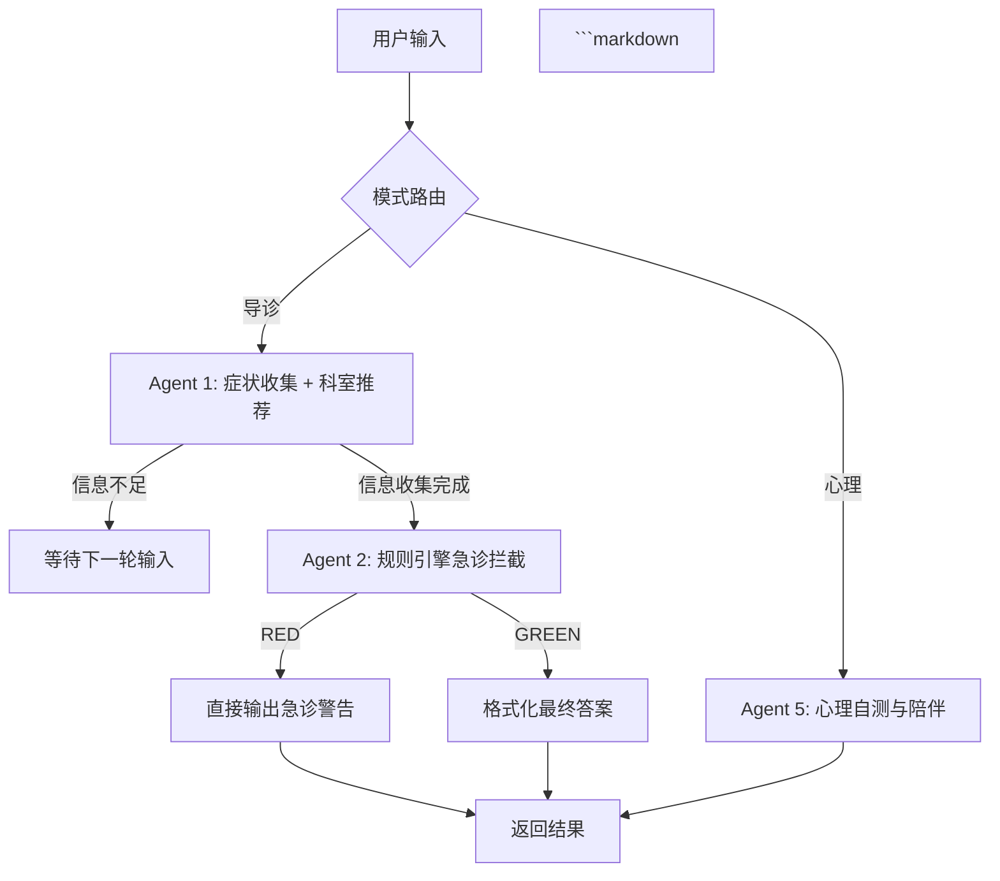
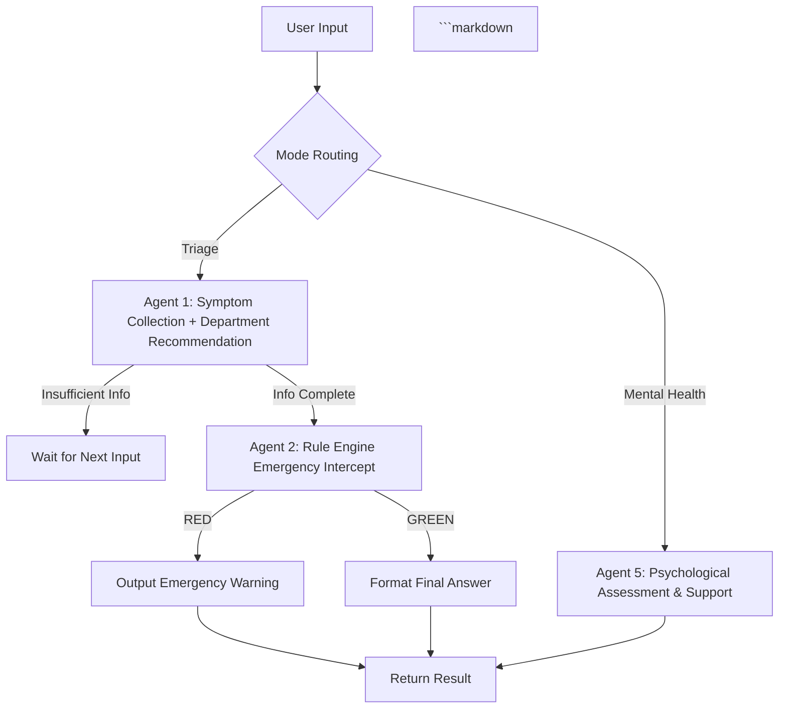

# 🏥 AI 健康导诊助手 · AI Health Triage Assistant

> *English version below · 英文版本见下方*

---

## 📌 目录 · Table of Contents

- [中文版](#chinese-version)
- [English Version](#english-version)

---

<a id="chinese-version"></a>
# 🇨🇳 中文版

> *基于 LangGraph 和 DeepSeek-V3 的智能导诊与心理支持系统 —— 单次 LLM 调用完成症状收集与科室推荐，响应速度提升 3 倍。*

[](https://www.python.org/)
[](https://langchain-ai.github.io/langgraph/)
[](https://gradio.app/)
[](https://deepseek.com/)

---

## 📌 项目简介

很多人在身体不适时不知道挂哪个科室，而通用大模型（如直接问 DeepSeek）往往问一两句就给出建议，**信息收集不充分，且存在幻觉风险**。

本项目通过 **LangGraph 构建确定性流程**，强制模型完成多轮追问（筛查危险信号、明确症状性质、询问时间背景）后才给出科室建议。同时，通过合并 Agent 节点，将完整问诊的 API 调用从 **3 次压缩至 1 次**，平均响应时间从 **6~9 秒降至 2~3 秒**。

---

## ✨ 核心功能

| 模块 | 说明 |
| :--- | :--- |
| **智能导诊** | 多轮追问收集症状（Red Flags → 性质/部位 → 时间背景），输出结构化 JSON，推荐 1~2 个挂号科室 |
| **急诊预警** | 硬编码规则引擎，零延迟识别「胸痛」「濒死感」「偏瘫」等高危信号，强制跳转急诊建议 |
| **心理支持** | 8 题心理自测（基于 PHQ-4 衍生），自动评分并给出就医建议；支持陪伴式暖心对话 |
| **安全护栏** | 输出层强制追加免责声明，禁止生成任何诊断结论或用药建议，确保医疗合规 |

---

## 🧠 系统架构

本项目采用 **LangGraph** 构建状态机，核心流程如下：



## 🎯 设计亮点

- **合并 Agent 节点**：将「科室匹配」功能合并入「症状收集」Agent，单次问诊仅调用 **1 次 LLM**（业界常规方案为 3 次）。
- **规则引擎兜底**：急诊拦截使用纯 Python 关键词匹配，**毫秒级响应**，不受 LLM 幻觉影响，可靠性 100%。
- **结构化输出**：强制 LLM 输出 JSON，前端可直接取用 `department` 和 `advice` 字段，无需额外解析。

---

## ⚡ 性能优化亮点

| 优化项 | 优化前 | 优化后 |
| :--- | :--- | :--- |
| **LLM 调用次数（完整问诊）** | 3 次（Agent1 + Agent3 + Agent4） | **1 次（仅 Agent1）** |
| **平均响应时间** | 6~9 秒 | **2~3 秒** |
| **急诊预警延迟** | 依赖 LLM（约 2 秒） | **毫秒级（规则引擎）** |
| **Prompt 长度** | 约 3000 tokens | 约 2200 tokens（精简 25%） |

---

## 🚀 快速开始

### 1. 环境要求
- Python 3.10 或以上
- 安装 `ffmpeg`（Gradio 音频组件依赖）：
  - **macOS**：`brew install ffmpeg`
  - **Ubuntu**：`sudo apt install ffmpeg`
  - **Windows**：从 [ffmpeg.org](https://ffmpeg.org/download.html) 下载并添加环境变量

### 2. 克隆项目与安装依赖
```bash
git clone https://github.com/你的用户名/AI_health_chatbox.git
cd AI_health_chatbox
pip install -r requirements.txt
```

### 3. 配置 API Key
在项目根目录创建 `.env` 文件，写入你的 SiliconFlow API Key：
```env
SILICONFLOW_API_KEY=sk-你的实际密钥
```
> 如果你没有 SiliconFlow 账户，可前往 [siliconflow.cn](https://siliconflow.cn) 注册获取免费额度。

### 4. 启动应用
```bash
python web.py
```
浏览器访问 `http://127.0.0.1:7860` 即可开始使用。

---

## 🖼️ 界面预览


<!--  -->

---

## 🛠️ 技术栈

| 类别 | 技术 |
| :--- | :--- |
| **大语言模型** | DeepSeek-V3（通过 SiliconFlow API 调用） |
| **工作流框架** | LangGraph + LangChain |
| **前端界面** | Gradio 4.0 |
| **开发语言** | Python 3.10 |
| **环境管理** | python-dotenv |

---

## 📂 项目结构

```
AI_health_chatbox/
├── main.py              # LangGraph 图定义、Agent 节点、Prompt 设计
├── web.py               # Gradio 前端界面及回调逻辑
├── requirements.txt     # Python 依赖列表
├── .env                 # 环境变量（API Key，不提交 Git）
├── README.md            # 项目说明文档
└── screenshots/         # 界面截图（自建）
```

---

## 🔮 未来规划

- [ ] 接入 Faster-Whisper 实现**离线语音输入**
- [ ] 接入 RAG（检索增强）实时更新最新医学指南
- [ ] 支持多科室联合会诊推荐（复杂症状场景）
- [ ] 部署至 Hugging Face Spaces 或云服务器

---

## 🙏 致谢

- 基础模型 [DeepSeek-R1-Distill-Llama-8B](https://huggingface.co/unsloth/DeepSeek-R1-Distill-Llama-8B)
- 推理框架 [LangGraph](https://langchain-ai.github.io/langgraph/)
- API 服务 [SiliconFlow](https://siliconflow.cn/)

---

## ⚠️ 免责声明

**本系统仅作为技术演示与辅助参考，不构成任何医疗诊断或治疗建议。** 所有输出结果仅供参考，具体诊疗请前往正规医疗机构，以执业医师的意见为准。使用本系统即表示您已知晓并同意此声明。

---

## 👩‍💻 作者

**汪思言 (Emily Wang)** — 大一学生 / AI 应用开发爱好者  
GitHub：[https://github.com/10Emy25/healthchatbox.git]  
邮箱：[siw077@ucsd.edu]


---

<a id="english-version"></a>
# English Version

> *An intelligent triage and psychological support system built with LangGraph and DeepSeek-V3 — reducing API calls to a single LLM invocation per consultation with 3x faster response time.*

[](https://www.python.org/)
[](https://langchain-ai.github.io/langgraph/)
[](https://gradio.app/)
[](https://deepseek.com/)

---

## 📌 Introduction

Many people don't know which department to visit when they feel unwell. General-purpose LLMs (like directly asking DeepSeek) often give suggestions after just one or two questions — **insufficient information gathering with hallucination risks**.

This project uses **LangGraph to build deterministic workflows**, forcing the model to complete multiple rounds of questioning (screening Red Flags → symptom characterization → timeline/context) before giving department recommendations. By merging Agent nodes, API calls per consultation are reduced from **3 to 1**, cutting average response time from **6~9 seconds down to 2~3 seconds**.

---

## ✨ Key Features

| Module | Description |
| :--- | :--- |
| **Smart Triage** | Multi-turn symptom collection (Red Flags → characterization → timeline), outputs structured JSON with 1~2 department recommendations |
| **Emergency Alert** | Hard-coded rule engine for zero-latency detection of critical signals like "chest pain", "impending doom", "hemiplegia" |
| **Psychological Support** | 8-question mental health self-assessment (PHQ-4 derived), auto-scoring with care suggestions; supportive empathetic conversation |
| **Safety Guardrails** | Mandatory disclaimer appended to all outputs; prohibits generation of any diagnosis or medication advice |

---

## 🧠 System Architecture

This project uses **LangGraph** to build a state machine. The core flow is as follows:



## 🎯 Design Highlights

- **Agent Merging**: Integrated "department matching" into the "symptom collection" Agent — only **1 LLM call** per consultation (industry standard: 3 calls).
- **Rule Engine Fallback**: Emergency interception uses pure Python keyword matching with **millisecond response**, 100% reliable with no LLM hallucination risk.
- **Structured Output**: Forces LLM to output JSON. Frontend can directly consume `department` and `advice` fields without extra parsing.

---

## ⚡ Performance Improvements

| Metric | Before Optimization | After Optimization |
| :--- | :--- | :--- |
| **LLM Calls (Full Consultation)** | 3 calls (Agent1 + Agent3 + Agent4) | **1 call (Agent1 only)** |
| **Average Response Time** | 6~9 seconds | **2~3 seconds** |
| **Emergency Alert Latency** | ~2 seconds (LLM-dependent) | **Millisecond (Rule Engine)** |
| **Prompt Length** | ~3000 tokens | ~2200 tokens (25% reduction) |

---

## 🚀 Quick Start

### 1. Environment Requirements
- Python 3.10 or higher
- Install `ffmpeg` (required by Gradio audio components):
  - **macOS**: `brew install ffmpeg`
  - **Ubuntu**: `sudo apt install ffmpeg`
  - **Windows**: Download from [ffmpeg.org](https://ffmpeg.org/download.html) and add to PATH

### 2. Clone & Install Dependencies
```bash
git clone https://github.com/your-username/AI_health_chatbox.git
cd AI_health_chatbox
pip install -r requirements.txt
```

### 3. Configure API Key
Create a `.env` file in the project root with your SiliconFlow API Key:
```env
SILICONFLOW_API_KEY=sk-your-actual-key
```
> If you don't have a SiliconFlow account, sign up at [siliconflow.cn](https://siliconflow.cn) for free credits.

### 4. Launch the App
```bash
python web.py
```
Open `http://127.0.0.1:7860` in your browser to start using it.

---

## 🖼️ Interface Preview


<!--  -->

---

## 🛠️ Tech Stack

| Category | Technology |
| :--- | :--- |
| **LLM** | DeepSeek-V3 (via SiliconFlow API) |
| **Workflow Framework** | LangGraph + LangChain |
| **Frontend** | Gradio 4.0 |
| **Language** | Python 3.10 |
| **Environment Management** | python-dotenv |

---

## 📂 Project Structure

```
AI_health_chatbox/
├── main.py              # LangGraph graph definition, Agents, Prompts
├── web.py               # Gradio frontend & callbacks
├── requirements.txt     # Python dependencies
├── .env                 # Environment variables (API Key, not committed)
├── README.md            # Project documentation
└── screenshots/         # Interface screenshots
```

---

## 🔮 Future Roadmap

- [ ] Integrate Faster-Whisper for **offline voice input**
- [ ] Add RAG (Retrieval-Augmented Generation) for real-time medical guideline updates
- [ ] Support multi-department joint recommendations for complex symptoms
- [ ] Deploy to Hugging Face Spaces or cloud servers

---

## 🙏 Acknowledgements

- Base Model: [DeepSeek-R1-Distill-Llama-8B](https://huggingface.co/unsloth/DeepSeek-R1-Distill-Llama-8B)
- Workflow Framework: [LangGraph](https://langchain-ai.github.io/langgraph/)
- API Service: [SiliconFlow](https://siliconflow.cn/)

---

## ⚠️ Disclaimer

**This system is for demonstration and reference purposes only and does not constitute medical diagnosis or treatment advice.** All outputs are for informational use only. Please consult licensed healthcare professionals for actual medical decisions. By using this system, you acknowledge and agree to this disclaimer.

---

## 👩‍💻 Author

**Emily Wang (Siyan Wang)** — First-year Undergraduate / AI Application Enthusiast  
GitHub: [https://github.com/10Emy25/healthchatbox.git]  
Email: [siw077@ucsd.edu]
```

---
